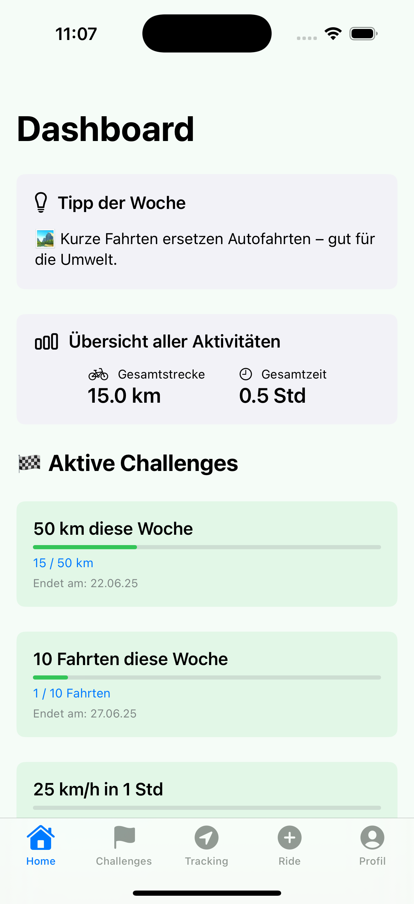
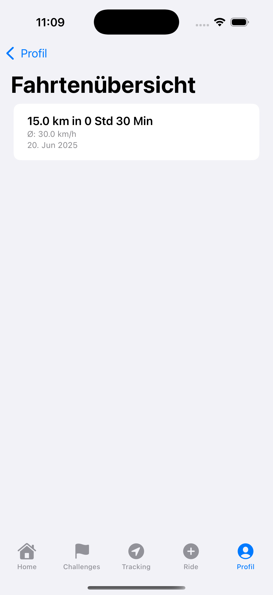
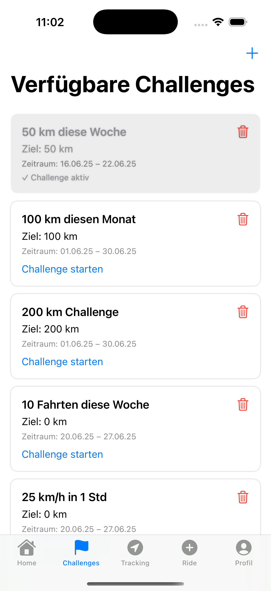
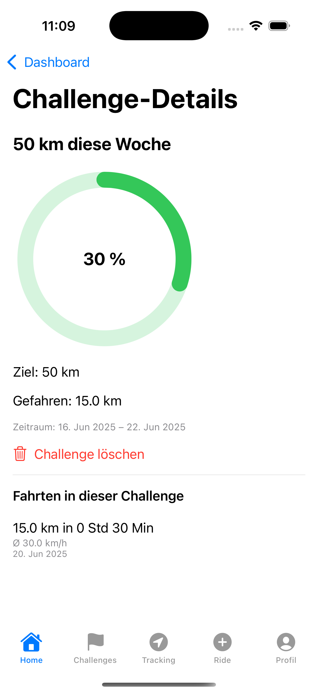
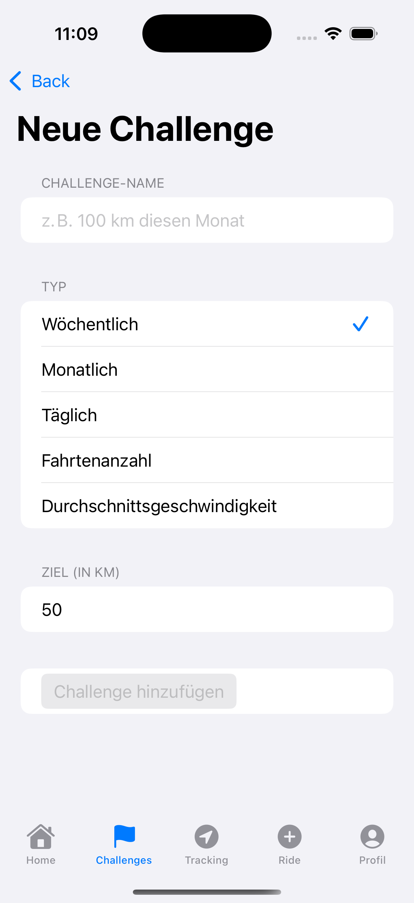
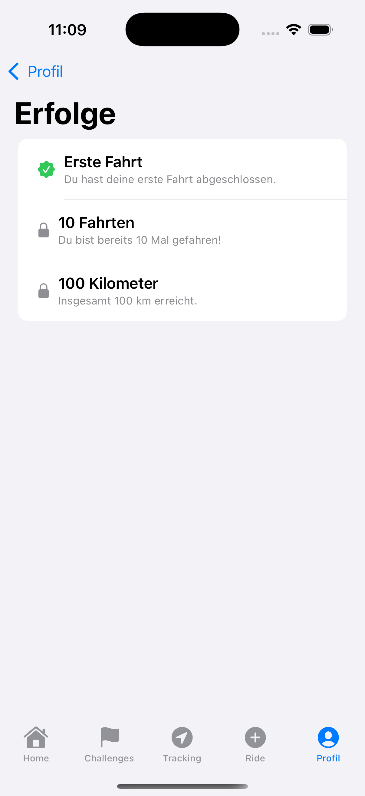
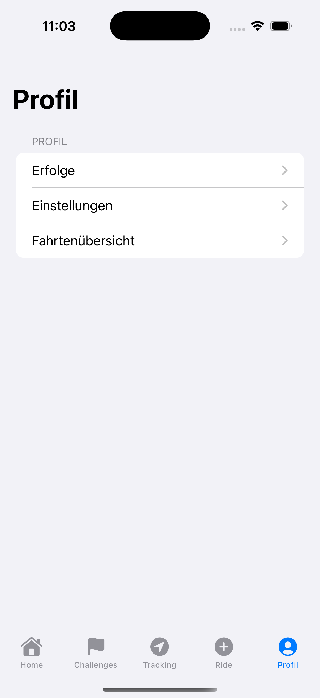
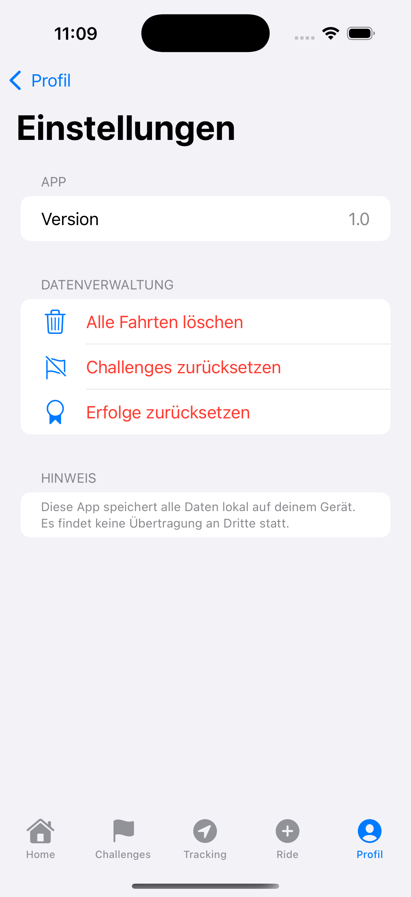

# BikeBuddy

BikeBuddy ist eine iOS-App zur Erfassung von Fahrradfahrten und zur Auswertung von Challenges.
Fahrten können manuell eingegeben oder per GPS live getrackt werden.
Die App wurde mit SwiftUI entwickelt und folgt dem MVVM-Architekturprinzip.
Alle Daten werden lokal auf dem Gerät gespeichert.

---

## ✨ Funktionen
- Manuelle Fahrtenerfassung (Datum, Distanz, Dauer)
- GPS-Tracking mit Live-Karte und Routenaufzeichnung
- Erstellung und Verwaltung von Challenges
- Fortschrittsanzeige während der Fahrt (z. B. Distanz, Dauer, Geschwindigkeit)
- Fahrtenhistorie
- Erfolge (Achievements)
- Lokale Datenspeicherung (UserDefaults & JSON)

---

## 🛠️ Technologien & Architektur

### Programmiersprache & UI
- Swift
- SwiftUI

### Architektur
- MVVM (Model–View–ViewModel)

### Apple Frameworks
- MapKit
- CoreLocation

### Persistenz
- UserDefaults
- JSON

---

## 🧱 Projektstruktur

Der App-Code befindet sich im App-Target BikeBuddy und ist wie folgt aufgebaut:

```text
BikeBuddy/
├── Helpers/ // Hilfsfunktionen & Extensions
├── Models/ // Datenmodelle (Ride, Challenge, Achievement)
├── Resources/ // Assets (Images, Farben)
├── Services/ // Services (z. B. StorageService)
├── SupportingFiles/ // App-Einstieg & Konfiguration
├── ViewModels/ // Logik & State-Management
│ ├── RideManager
│ ├── ChallengeManager
│ ├── LocationManager
│ └── AchievementManager
└── Views/ // SwiftUI Views
├── DashboardView
├── GPSTrackingView
├── RideHistoryView
├── ChallengeViews
└── AchievementView
```

---

## 🚀 Installation

- Repository klonen oder herunterladen
- Projekt mit Xcode öffnen (BikeBuddy.xcodeproj)
- App im Simulator oder auf einem realen iOS-Gerät starten

---

## 📸 Screenshots

<p align="center">
  
  
  
</p>

<p align="center">
  
  
  
</p>

<p align="center">
  
  
  
</p>

<p align="center">
  
</p>

---


## 📄 Lizenz & Hinweis

Dieses Projekt ist ein privates Hochschulprojekt
und nicht für den produktiven Einsatz vorgesehen.

---

## ℹ️ Hinweise

- Alle Daten werden ausschließlich lokal gespeichert
- Keine Cloud-Anbindung
- Fokus liegt auf SwiftUI, MVVM und sauberer Projektstruktu
