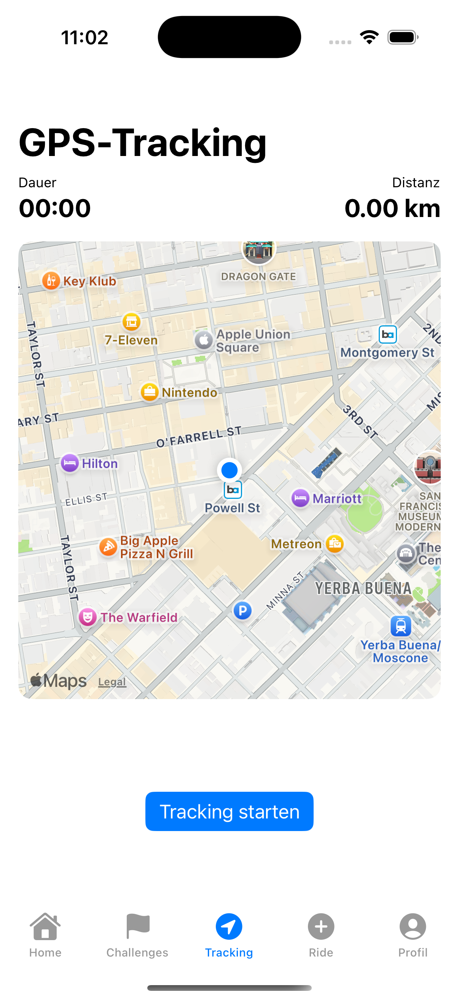

# BikeBuddy

BikeBuddy ist eine iOS-App zur Erfassung von Fahrradfahrten und zur Auswertung von Challenges.
Fahrten können manuell eingegeben oder per GPS live getrackt werden.
Die App wurde mit SwiftUI entwickelt und folgt dem MVVM-Architekturprinzip.
Alle Daten werden lokal auf dem Gerät gespeichert.

---

##✨ Funktionen
Manuelle Fahrtenerfassung (Datum, Distanz, Dauer)
GPS-Tracking mit Live-Karte und Routenaufzeichnung
Erstellung und Verwaltung von Challenges
Fortschrittsanzeige während der Fahrt (z. B. Distanz, Dauer, Geschwindigkeit)
Fahrtenhistorie
Erfolge (Achievements)
Lokale Datenspeicherung (UserDefaults & JSON)

---

##🛠️ Technologien & Architektur
Programmiersprache & UI
Swift
SwiftUI
Architektur
MVVM (Model–View–ViewModel)
Apple Frameworks
MapKit
CoreLocation
Persistenz
UserDefaults
JSON
Es werden keine externen Third-Party-Libraries verwendet.

---

##🧱 Projektstruktur
Der App-Code befindet sich im App-Target BikeBuddy und ist wie folgt aufgebaut:
'''
BikeBuddy/
├── Helpers/ // Hilfsfunktionen & Extensions
├── Models/ // Datenmodelle (Ride, Challenge, Achievement)
├── Resources/ // Assets (Images, Farben)
├── Services/ // Services (z. B. StorageService)
├── SupportingFiles/ // App-Einstieg & Konfiguration
├── ViewModels/ // Logik & State-Management
│ ├── RideManager
│ ├── ChallengeManager
│ ├── LocationManager
│ └── AchievementManager
└── Views/ // SwiftUI Views
├── DashboardView
├── GPSTrackingView
├── RideHistoryView
├── ChallengeViews
└── AchievementView
'''

---

##🚀 Installation
Repository klonen oder herunterladen
Projekt mit Xcode öffnen (BikeBuddy.xcodeproj)
App im Simulator oder auf einem realen iOS-Gerät starten

---

##📸 Screenshots
'''

'''

---

##📄 Lizenz & Hinweis
Dieses Projekt ist ein privates Hochschulprojekt
und nicht für den produktiven Einsatz vorgesehen.

---

##ℹ️ Hinweise
Alle Daten werden ausschließlich lokal gespeichert
Keine Cloud-Anbindung
Fokus liegt auf SwiftUI, MVVM und sauberer Projektstruktu
